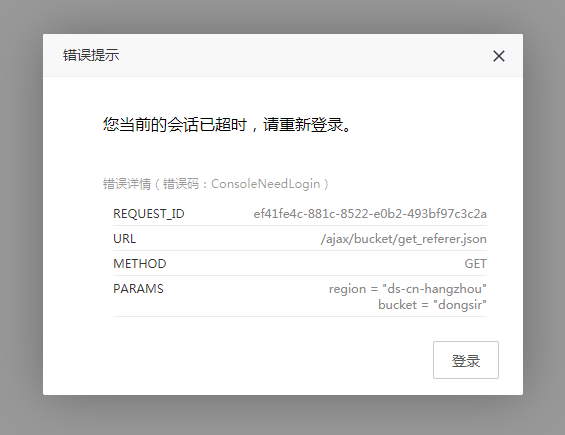

## 仿阿里云的错误提示弹层

仿阿里云的错误提示 dialog - 您当前的会话已超时，请重新登录。

主要用在后台管理 - 识别到用户的登录状态超时的温馨提示。



完整示例：

```html
<!DOCTYPE html>
<html>
<head>
<meta charset="utf-8">
<title>错误提示</title>
<link rel="stylesheet" href="../../layui/css/layui.css" media="all">
</head>
<body>
<style type="text/css">
html, body{
    font-family: 'Hiragino Sans GB', 'Noto Sans CJK SC', -apple-system, BlinkMacSystemFont, 'PingFang SC', 'Helvetica Neue', 'Microsoft Yahei', Tahoma, Simsun, sans-serif;
}

.ds-rc-dialog .dialog-bd{position:relative;padding:24px}
.ds-rc-dialog-hoc-wrapper{position:relative;min-height:60px;font-size:12px}
.ds-rc-dialog-hoc-wrapper .the-icon{position:absolute;top:12px;left:0}
.ds-rc-dialog-hoc-wrapper .the-message{padding:12px 12px 0 36px;line-height:1.4;white-space:normal;word-wrap:break-word}
.ds-op-alert-error-content .error-detail{margin:1em 0 0 1em;font-size:10px}
.ds-rc-key-value>.an-item{display:flex}
.ds-rc-key-value.thm-error>.an-item{padding:4px 0;border-bottom:1px solid #ebebeb}
.ds-rc-key-value>.an-item .item-k{margin-right:1em;color:#888}
.ds-rc-key-value.thm-error>.an-item .item-k{min-width:5em;text-transform:uppercase;color:#333}
.ds-rc-key-value>.an-item .item-v{color:#333;white-space:normal;word-break:break-all;word-wrap:break-word}
.ds-rc-key-value.thm-error>.an-item .item-v{color:#888;flex:1;text-align:right}
.ds-op-alert-error-content .error-message-holder{font-size:16px}
.ds-op-alert-error-content .error-detail-title{margin-top:40px;color:rgba(51,51,51,.5);font-size:12px;text-align:left;white-space:normal}
.ds-rc-dialog .dialog-ft{padding:0 24px 16px 24px;text-align:right}

</style>
<div id="layer-error-msg" style="display: none;">
    <div class="ds-rc-dialog">
        <div class="dialog-bd">
            <div class="ds-rc-dialog-hoc-wrapper">
                <div class="the-icon"><i class="ds-rc-icon next-icon next-icon-warning"></i>
                </div>
                <div class="the-message">
                    <div class="ds-op-alert-error-content with-details">
                        <div class="error-message-holder">您当前的会话已超时，请重新登录。</div>
                        <div class="error-detail-title">错误详情（错误码：ConsoleNeedLogin）</div>
                        <div class="ds-rc-key-value thm-error error-detail">
                            <div class="an-item">
                                <div class="item-k">REQUEST_ID</div>
                                <div class="item-v">ef41fe4c-881c-8522-e0b2-493bf97c3c2a</div>
                            </div>
                            <div class="an-item">
                                <div class="item-k">url</div>
                                <div class="item-v">/ajax/bucket/get_referer.json</div>
                            </div>
                            <div class="an-item">
                                <div class="item-k">method</div>
                                <div class="item-v">GET</div>
                            </div>
                            <div class="an-item">
                                <div class="item-k">params</div>
                                <div class="item-v">
                                    <div>
                                        <div>region = "ds-cn-hangzhou"</div>
                                        <div>bucket = "dongsir"</div>
                                    </div>
                                </div>
                            </div>
                        </div>
                    </div>
                </div>
            </div>
        </div>
        <footer class="dialog-ft">
            <button type="button" class="layui-btn layui-btn-primary" role="button">登录</button>
        </footer>
    </div>
</div>
<script src="../../layui/layui.js"></script>
<script>
layui.use('form', function(){
    var $ = layui.$;
    layer.open({
        type: 1,
        title: ['错误提示'],
        shade: 0.4,
        area:['480px'],
        content: $("#layer-error-msg").html(),
        success: function(layero, index){}
    });
});
</script>
</body>
</html>

```

